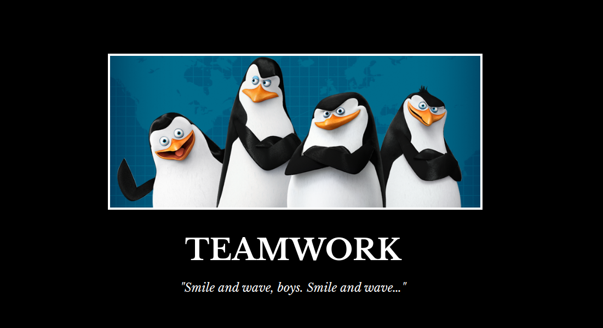

# CSS Properties Project

## 📖 **About the Project**

This project is part of the **"Become a Full-Stack Web Developer with just ONE course"** by **Dr. Angela Yu** on Udemy. It was completed after finishing **Section 6: CSS Properties** to practice and enhance understanding of CSS styling properties.

---

## 🛠 **Technologies Used**

- **HTML**: For structuring the content.
- **CSS**: For styling and layout of the page.

---

## 🎯 **Project Objectives**

- Apply various **CSS properties** to style a web page.
- Create a visually appealing meme layout using:
  - Font styling and alignment.
  - Image positioning and borders.
  - Background colors and overall page aesthetics.

---

## 📂 **File Structure**

- `index.html`: Contains the structure of the page.
- `styles.css`: Contains the CSS rules to style the page.

---

## ✨ **Features**

1. **Header Section:**

   - Title: "TEAMWORK" styled with large, bold, and centered text.
   - Subtitle: "Smile and wave, boys. Smile and wave…" styled with smaller, italicized text.

2. **Image Section:**

   - A centered image with a white border and subtle shadow effect to enhance its appearance.

3. **Styling Details:**
   - Dark background to create contrast with the text and image.
   - Font properties (`font-size`, `font-weight`, `text-align`) to improve readability and aesthetics.
   - Image dimensions and styling to ensure proper alignment and visual appeal.

---

## 📸 **Project Preview**

Here is a screenshot of the project:



---

## 🧠 **What I Learned**

- How to use **CSS properties** such as `text-align`, `font-weight`, `font-size`, and `color`.
- How to style images with borders and shadows.
- How to use **background colors** to enhance the design.

---

## 🚀 **How to Run the Project**

1. Clone this repository to your local machine:
   ```bash
   git clone https://github.com/rizkibagus/css-properties-project.git
   ```
2. Open the `index.html` file in your browser.

---

## 📝 **Notes**

This project highlights the importance of CSS in creating visually appealing web pages. Feedback and suggestions are always welcome!

---

Let me know if you'd like any adjustments or additional details! 😊
